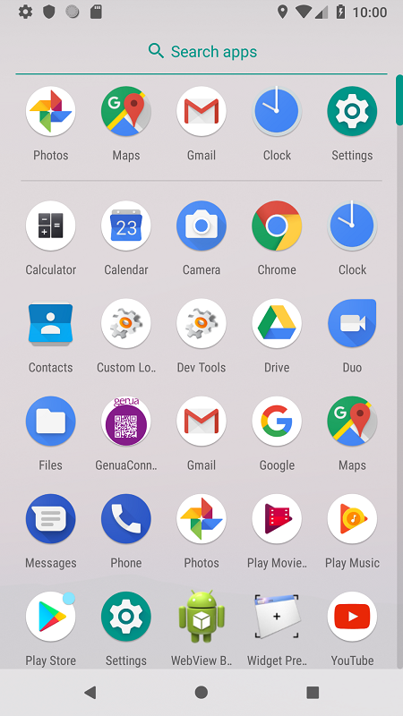
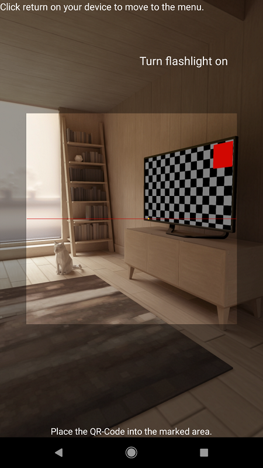
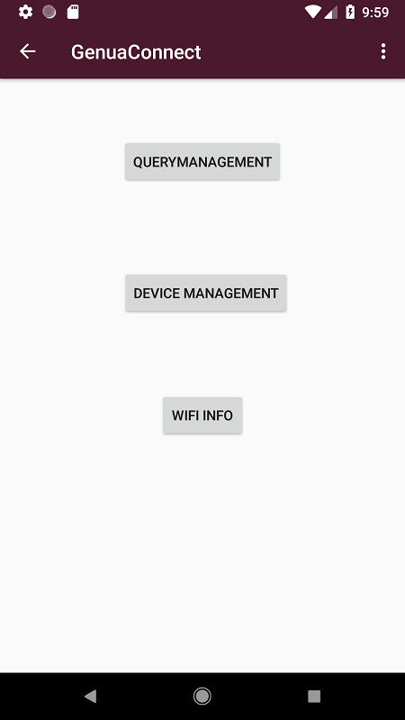
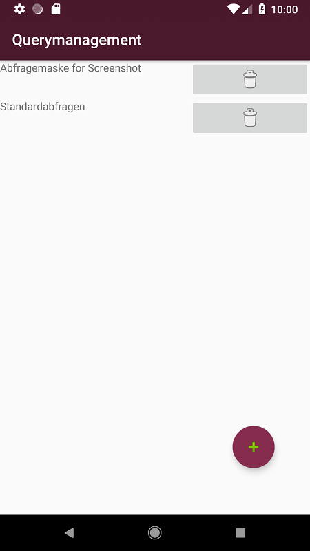
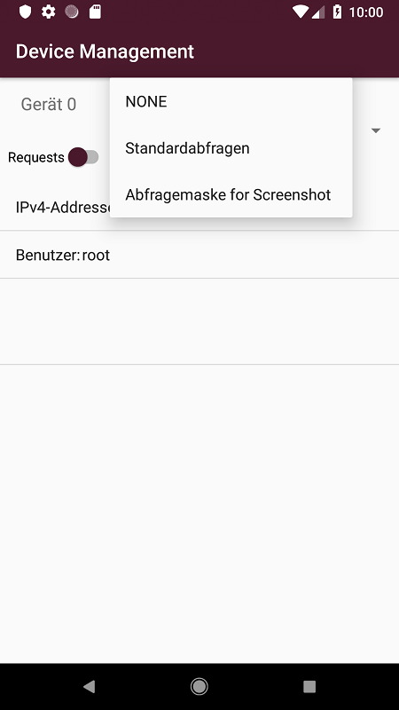
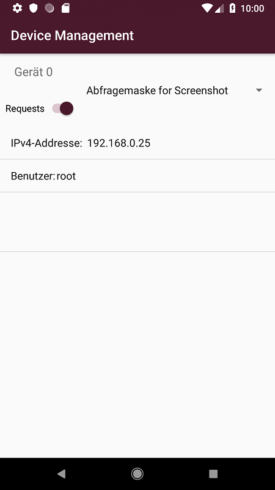

# Genua Connect

Screenshot of Genua Connect (in use) / in app view by Arton Kastrati

Screenshot of Genua Connect (in use) / in app view by Arton Kastrati

Screenshot of Genua Connect (in use) / in app view by Arton Kastrati

Screenshot of Genua Connect (in use) / in app view by Arton Kastrati

Screenshot of Genua Connect (in use) / in app view by Arton Kastrati

Screenshot of Genua Connect (in use) / in app view by Arton Kastrati

Administratoren (Admins) müssen operative Tätigkeiten an Rechnern/Firewalls in den Rechenzentren tätigen (Updates, Abstürze untersuchen, Hardware-Defekte).
Bei solchen Arbeiten ist nebem dem Finden der richtigen Hardware der Zustand der Appliance wichtig:
Wurden für die Wartungsarbeiten bespielsweise die produktiven IP-Adressen an das High Availability (HA)-Pendant im anderen Rechenzentrum-Abschnitt abgegeben?
Oftmals sind Wartungsfenster zeitlich sehr kurz bemessen oder zu Zeiten, bei denen eine zügige Bearbeitung erforderlich ist.
Ein App, die den Status der Maschine ermittelt und anzeigt ist eine erhebliche Erleichterung für die Durchführung und Kontrolle von Wartungsarbeiten.

Genua diese Problematiken löst die Application *Genua Connect*. Sie ermöglicht es dem Nutzer, mittels einem QR-Code, sich mit dem Intranet zu verbinden. Ändert sich das Passwort
so erhält der Nutzer eine Benachrichtigung und wird geben den QR-Code erneut zu scannen.
Ist die Verbindung sicher und es verbleibt genügend Zeit bis zur nächsten Passwort aktualisierung des Intranets, so kann der Nutzer sich zu einem Gerät begeben und mittels dem inbegriffenen
QR-Code scanner, über vordefinierte Abfragemasken, sich die gewünschten Informationen anzeigen zu lassen.

## Features

### Critical Features

#### Verbindung und Abfragenanzeige

- Einlesen der WLAN-Zugangsdaten ist via QR-Code möglich.

- Nach dem Einscannen ist das Smartphone mit dem vorgegebenen WLAN verbunden.

- Bei sich ändernden WLAN-Zugangsdaten (Änderung Passwort, aber Access-Point-Name und MAC gleich) sind keine weiteren Benutzer-Interaktionen (außer QR-Code scannen) nötig.

- Die Netzwerkparameter des WLANs (IPv4-, IPv6-Adresse, Netzmaske, DNS-Server-IP, Gateway-IP) inkl. DHCP-Zuweisung werden dargestellt.

- In unverschlüsselte WLANs bucht sich die App nicht ein, auch nicht im Fehlerfall.

- Beim Wechsel in ein unverschlüsseltes WLAN wird eine Fehlermeldung angezeigt und es werden keine Daten übertragen.

- Beim Wechsel in das gesicherte WLAN wird der Betrieb der Anwendung wieder im ursprünglichen Zustand aufgenommen.

- Einlesen der Geräte-Daten und -Zugangsdaten ist via QR-Code möglich.

- Standard-Abfragen (1.3.6.1.2.1.1) werden vom Gerät abgefragt und angezeigt.

- Gestartete Abfragen werden periodisch erneut abgefragt.

#### Verwalten von Abfragen

- Abfragen können verwaltet (neu angelegt, bearbeitet, angesehen und gelöscht) werden.

- Abfragen enthalten mindestens eine Bezeichnung, eine OID (min. Dot-Notation) den erwarteten Rückgabewert-Typ.

- Abfragen können keiner, einer order mehreren Kategorien (Art der Hardware) zugeordnet werden.

- Abfragen können gestartet werden und das Result angezeigt werden.

### Additional Features

- App kann auf das Handylicht zugreifen und dieses bei Bedarf aktivieren.
- In App Sprache passt sich der Systemsprache an.
- snmpv3 wurde realisiert.
- App Icon wurde eingebettet.

## Installation

1. Repository klonen: `git clone`
2. Android Studio Projekt öffnen
3. Android Studio Projekt bauen
4. Android Studio Projekt im Emulator ausführen oder APK erstellen lassen

## Verwendung der App

Administratoren (Admins) müssen operative Tätigkeiten an Rechnern/Firewalls in den Rechenzentren tätigen (Updates, Abstürze untersuchen, Hardware-Defekte).
Dafür begibt sich diese Person in den Bereich der Rechnern. Falls diese noch nicht mit dem Intranet verbunden ist, so kann sich diese beim starten der App direkt mit diesem mittels des QR-Code scanners verbinden.

### Wichtiger Anwendungsfall 1
 Nachdem sich nun der Admin zu dem gewünschtem Geräte begeben hat, kann er als nächstes den QR-Code des Gerätes einscannen. Jetzt kann er in der App Abfragemasken verwalten, indem er erst zurück geht und dann im Abfragemenü diese erstellt für das eingescannte Gerät. Nach der Abfrage erscheint das Ergebnis unter dem Block für das Gerät.
### Wichtiger Anwendungsfall 2
Der Admin kann bevor er sich mit dem WLAN verbindet oder sich zum Gerät begibt eine Abfragemaske erstellen. Begibt er sich danach zum Gerät kann er diese direkt ausführen und erhält das Ergebnis in der App angezeigt.
### Wichtiger Anwendungsfall 3
Ist der Nutzer sich sicher, dass er eine gewisse Abfragemaske nicht mehr verwenden wird so kann er diese löschen, indem er auf das dafür vorgesehne Icon klickt.
### Wichtiger Anwendungsfall 4
Falls der Nutzer eine Abfragemaske nur leicht verädnern, so kann er dies indem er auf die Abfragemaske klickt und diese nach belieben bearbeitet.

## Changelog

Die Entwicklungsgeschichte befindet sich in [CHANGELOG.md](CHANGELOG.md).

## Verwendete Bibliotheken

implementation 'com.journeyapps:zxing-android-embedded:3.6.0'

api 'org.snmp4j:snmp4j:2.5.0'

## Lizenz

Copyright 2019 Baran Demir, Samuel Gigliotti, Arton Kastrati

Licensed under the Apache License, Version 2.0 (the "License");
you may not use this file except in compliance with the License.
You may obtain a copy of the License at

[http://www.apache.org/licenses/LICENSE-2.0](http://www.apache.org/licenses/LICENSE-2.0)

Unless required by applicable law or agreed to in writing, software
distributed under the License is distributed on an "AS IS" BASIS,
WITHOUT WARRANTIES OR CONDITIONS OF ANY KIND, either express or implied.
See the License for the specific language governing permissions and
limitations under the License.

Also see [LICENSE](https://sopra.informatik.uni-stuttgart.de/sopra-ws1819/sopra-team-23/blob/master/LICENSE).