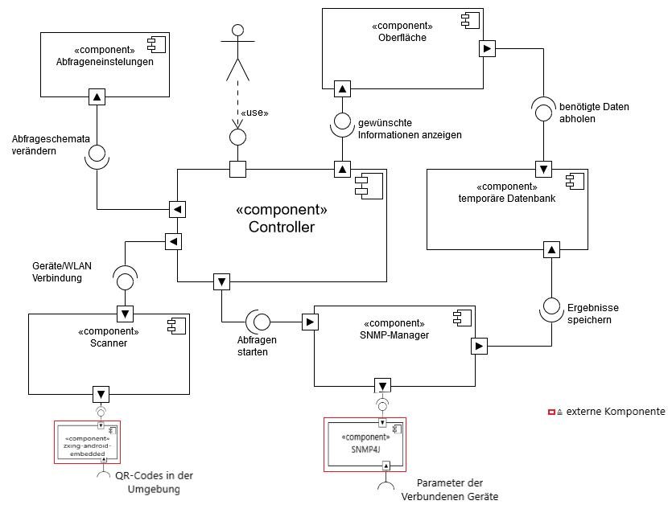

# Einführung

Dieser Entwurf legt die prinzipielle Lösungsstruktur fest und enthält alles, was man benötigt, um einem Außenstehenden den prinzipiellen Aufbau der App erklären zu können. Hier wird das Gesamtsystem in überschaubare Einheiten gegliedert und diese können potenziell in zukünftigen Projekten wiederverwendet werden.

Es wird versucht das Model-View-Controller Prinzip als Vorbild für den Aufbau umzusetzen.

Es wurden folgende Entwurfsmuster genutzt:
- Singelton: Eine Instanz für bestimmte Klassen.
- Observer: Ein Subjekt wird von Beobachtern abboniert und benachrichtigt bei Änderung die Beobachter.

# Komponentendiagramm

*Komponentendiagramm 2.0*

## Komponente 1: Controller
Der Controller ist die Komponente, die die Benutzereingaben auswertet und die Komponenten aktiviert oder benachrichtigt, die für die Ausführung der gewünschten Aktivität benötigt werden. Dafür werden Schnittstellen zu fast allen anderen Komponenten benötigt.

## Komponente 2: Abfrageneinstellungen
Diese Komponente ist dafür zuständig, Abfrageschemata zu verwalten. Dazu gehören neue Abfrageschemata zu erstellen, zu löschen und zu bearbeiten. Diese können dann verwendert werden, um bei Geräteverbindung nur bestimmte Daten zu erhalten.

## Komponente 3: Scanner
Diese Komponente ist dafür zuständig, mit Hilfe der Handykamera QR-Codes von WLAN oder Geräten im Rechenzentrum zu lesen und die entschlüsselten Daten weiterzuleiten. Diese Komponente ist essentiell um Verbindungen herzustellen und neue Geräte zu vebinden.

## Komponente 4: SNMP-Manager:
Der SNMP-Manager ist dafür zuständig, über SNMP die Abfragen von den verbundenen Geräten zu starten und periodisch die Daten zu aktualisieren. Die zurückgegebenen Daten werden über eine Schnittstelle an die temporäre Datenbank geleitet.

## Komponente 5: temporäre Datenbank
Diese Komponente ist dazu da, die in der aktuellen Sitzung erstellten Verbindungen zu speichern und bei bestimmten Abfragen weiterzuleiten. Die Datenbank hat Schnittstellen zum SNMP-Manager und zur Oberfläche.

## Komponente 6: Oberfläche
Diese Komponente bietet die Schnittstelle zum Benutzer. Sie versucht für den Benutzer die Daten und Informationen aus der Datenbank übersichtlich darzustellen und Benutzereingaben an den Controller weiter zu geben.

## Externe Komponente
**TODO:** Beschreibung der **externen** Komponente/Bibliothek und wie diese verwendet werden soll.

### zxing-android-embedded
### snmp4j

# Klassendiagramm

*Klassendiagramm 1.0*
## Beschreibung der wichtigen Klassenhierarchie 1
Die wichtigsten Klassen sind Startbildschrim, Scan, Menü, Optionen, AbragenMenü, AbfragenSchema, GeräteListe und die Geräte.

- Im *Startbildschrim* findet sich die *Scan* Klasse und das *Menü*.
- Im *Menü* ist die *Optionen* Klasse, das *AbfrageMenü* und die *GeräteListe* vorzufinden.
- Im *AbfrageMenü* findet man die *AbfragenSchema* Klasse vor.
- In der *GeräteList* befindet sich die *Geräte* Klasse.

Die Klassen werden in das *Model-View-Controller* Prinzip eingefügt.

## Klasse 1: ReactionController
> In dieser Klasse wird definiert, wie auf die QR-Code reagiert werden soll.

## Klasse 2: ApplianceQrDecoder
> Diese Klasse getttett die Informationen aus dem QR-Code.

## Klasse 3: RotatingCaptureActivity
> Diese Klasse ist für den QR-Code Scanner zuständig.

## Klasse 4: ApplianceManger
> Verwaltet die Geräte, welche gescannt wurden.

## Klasse 5: SnmpAdapter
> Verwaltet die SNMP-Klassen mit den jeweiligen aufgaben.

## Klasse 6: MonitoringMainActivity
> device mngr

## Klasse 7: CustomizeAdapter
> 

## Klasse 8: CustomizeRequestActivity
> 

## Klasse 9: OverviewAdapter
> 

## Klasse 10: RequestDbHelper
> 

## Klasse 11: RequestMngActivity
> 

## Klasse 12: ReqeustContract
> 

## Klasse 13: SimpleSNMPClientV1AndV2c
> 

## Klasse 14: SimpleSNMPClienttv3
> 

## Klasse 15: SnmpTask
> 

## Klasse 16: WifiConnect
> 

## Klasse 17: WifiStateActivity
> 

# GUI-Skizze

GUI-Skizze von Arton Kastrati, Baran Demir, Samuel Gigliotti