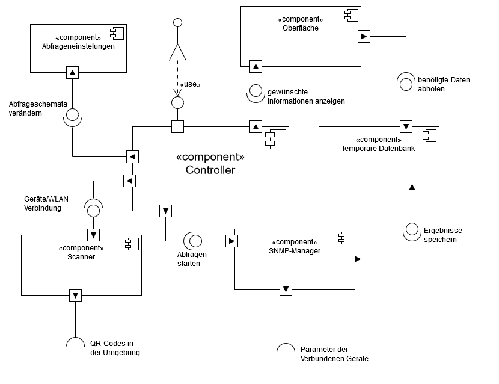
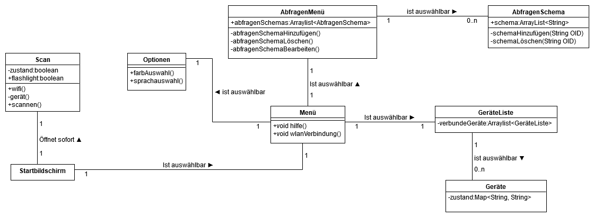
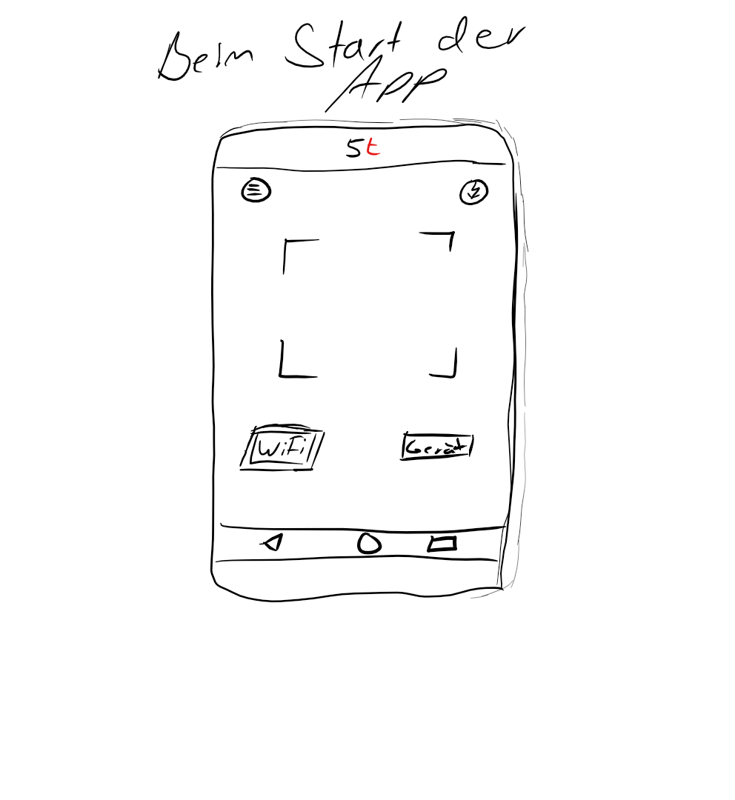
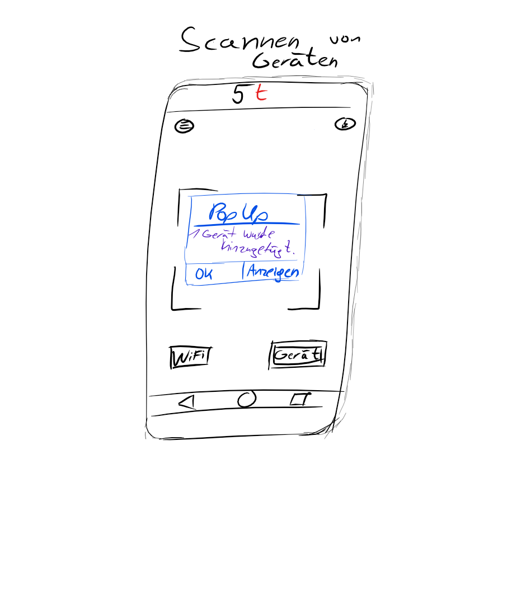
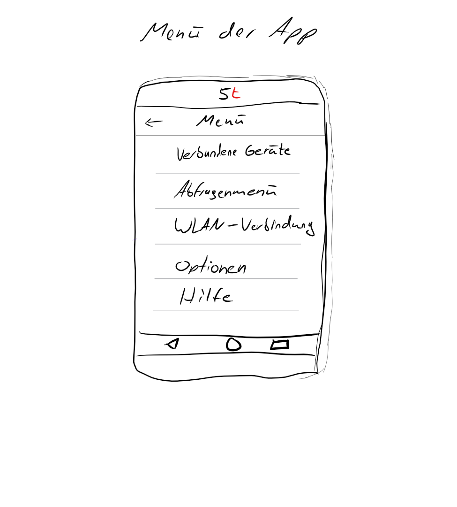

# Einführung

Dieser Entwurf legt die prinzipielle Lösungsstruktur fest und enthält alles, was man benötigt, um einem Außenstehenden den prinzipiellen Aufbau der App erklären zu können. Hier wird das Gesamtsystem in überschaubare Einheiten gegliedert und diese können potenziell in zukünftigen Projekten wiederverwendet werden.

Es wird versucht das Model-View-Controller Prinzip als Vorbild für den Aufbau umzusetzen.

Es wurden folgende Entwurfsmuster genutzt:
- Singelton: Eine Instanz für bestimmte Klassen.
- Observer: Ein Subjekt wird von Beobachtern abboniert und benachrichtigt bei Änderung die Beobachter.

# Komponentendiagramm

*Komponentendiagramm 2.0*

## Komponente 1: Controller
Der Controller ist die Komponente, die die Benutzereingaben auswertet und die Komponenten aktiviert oder benachrichtigt, die für die Ausführung der gewünschten Aktivität benötigt werden. Dafür werden Schnittstellen zu fast allen anderen Komponenten benötigt.

## Komponente 2: Abfrageneinstellungen
Diese Komponente ist dafür zuständig, Abfrageschemata zu verwalten. Dazu gehören neue Abfrageschemata zu erstellen, zu löschen und zu bearbeiten. Diese können dann verwendert werden, um bei Geräteverbindung nur bestimmte Daten zu erhalten.

## Komponente 3: Scanner
Diese Komponente ist dafür zuständig, mit Hilfe der Handykamera QR-Codes von WLAN oder Geräten im Rechenzentrum zu lesen und die entschlüsselten Daten weiterzuleiten. Diese Komponente ist essentiell um Verbindungen herzustellen und neue Geräte zu vebinden.

## Komponente 4: SNMP-Manager:
Der SNMP-Manager ist dafür zuständig, über SNMP die Abfragen von den verbundenen Geräten zu starten und periodisch die Daten zu aktualisieren. Die zurückgegebenen Daten werden über eine Schnittstelle an die temporäre Datenbank geleitet.

## Komponente 5: temporäre Datenbank
Diese Komponente ist dazu da, die in der aktuellen Sitzung erstellten Verbindungen zu speichern und bei bestimmten Abfragen weiterzuleiten. Die Datenbank hat Schnittstellen zum SNMP-Manager und zur Oberfläche.

## Komponente 6: Oberfläche
Diese Komponente bietet die Schnittstelle zum Benutzer. Sie versucht für den Benutzer die Daten und Informationen aus der Datenbank übersichtlich darzustellen und Benutzereingaben an den Controller weiter zu geben.

## Externe Komponente

### zxing-android-embedded
Ermöglicht es den QR-Code zu sacnnen und Informationen als einen String wiederzugeben.
### snmp4j
Ermöglicht alle Abfragen zu starten und Geräte zu spezifizieren.
# Klassendiagramm

*Klassendiagramm 2.0*

## Beschreibung der wichtigen Klassenhierarchie 1
Die wichtigsten Klassen sind Startbildschrim, Scan, Menü, Optionen, AbragenMenü, AbfragenSchema, GeräteListe und die Geräte.

- Im *Startbildschrim* findet sich die *Scan* Klasse und das *Menü*.
- Im *Menü* ist die *Optionen* Klasse, das *AbfrageMenü* und die *GeräteListe* vorzufinden.
- Im *AbfrageMenü* findet man die *AbfragenSchema* Klasse vor.
- In der *GeräteList* befindet sich die *Geräte* Klasse.

Die Klassen werden in das *Model-View-Controller* Prinzip eingefügt.

## Klasse 1: ReactionController
>  Erhält die Informationen als String dur *RotatingCaptureActivity* Bestimmt wie auf einen eingescannten QR-Code reagiert wird. Unterschieden wird zwischen 2 wesentlich verschiedenen Fällen:
> - Ein WLAN QR-Code wird gescannt: Dann werden in der WifiConnect Klasse die einzelnen Komponenten identifiziert.
> - Ein Geräte QR-Code wird gescannt: Hier wird auch unterschieden ob es sich in dem QR-Code um die implementierte snmp v1,v2 oder um die v3 handelt und dann an die jeweilige Klasse weitergeleitet.

## Klasse 2: RotatingCaptureActivity
> Diese Klasse ist der eigentlicher "Scanner" der App. Sie erkennt den QR-Code und gibt den Inhalt als String wieder. Enthält ebenfalls den Button für das Handylicht.

## Klasse 3: ApplianceManger
> Verwaltet alle SNMP Geräte welche vorher gescannt wurden, sowie deren Abfragen und die Ergebnisse.

## Klasse 4: MonitoringMainActivity
> Stellt die Geräte und deren Ergebnisse als Listenelemente dar. Zudem wird mit einer switch ermöglicht, dass Abfragen ein und ausgeschaltet werrden können. Ein spinner ermöglicht außerdem die Auwahl einer Abfragemaske.

## Klasse 5: CustomizeRequestActivity
> Diese Klasse ist für den Aufbau bzw. der Bearbeitung einer Abfragemasken zuständig. Durch den "+" - Button kann der Nutzer innerhalb eines Popups eine neue OID für die ausgewählte Abfragemaske festlegen. Außerdem ist der Name der Abfragemaske änderbar.

## Klasse 6: RequestMngActivity
> Liefert eine Übersicht über alle Abfragemasken. Mithilfe eines Buttons können neue Abfragen mit einem Default-Namen hinzugefügt werden.

## Klasse 8: SimpleSNMPClientV1AndV2c
> Verwaltet SNMP-Abfragen. Die Klasse settet die pdu, community target, retrys und timeouts.

## Klasse 10: SimpleSNMPClienttv3
> Verwaltet SNMP-Abfragen. Diese Klasse settet das Sicherheitslevel, den Username und beide passwörter, welche für das Protokoll benötigt werden.

## Klasse 11: SnmpTask
> Führt einen Neuen Thread aus der nicht auf der ui läuft. Dies dient der Vernetzung.

## Klasse 12: WifiConnect
> Erhalt von ReactionController den QR-Code als String, falls dieser "WIFI" enthält. Die WLAN cretantials werden dann aus dem String extrahiert und ausgewertet. Das Handy verbindet sich dann mit dem WLAN.

# GUI-Skizze
> Skizzen entsprechen lediglich dem Entwurf. Sie zeigen nicht zwingend das endgültige Aussehen der fertigen App.

GUI-Skizze von Arton Kastrati, Baran Demir, Samuel Gigliotti